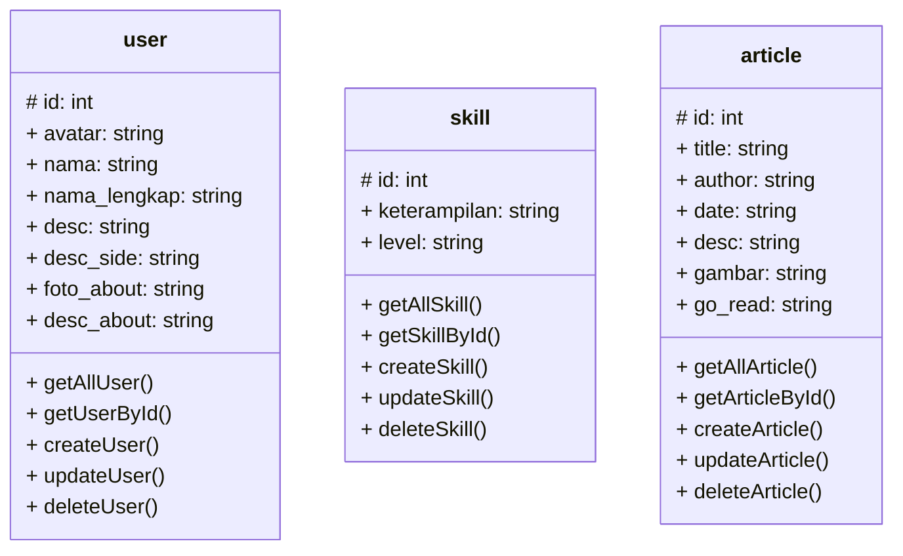

## API Points

API Point yang saya gunakan untuk membuat side server pada portfolio saya di antaranya users, skills, dan article

### Users

#### Menampilkan semua pengguna

```
GET: /users

respones:
[
    {
        "id"              : "",
        "avatar"          : "",
        "nama"            : "",
        "nama_lengkap"    : "",
        "desc"            : "",
        "desc_side"       : "",
        "foto_about"      : "",
        "desc_about"      : ""
    }
    ...
]
```

#### Menampilkan user berdasarkan `id` tertentu

```
GET: /users/[id]

response:
{
    "id"              : "",
    "avatar"          : "",
    "nama"            : "",
    "nama_lengkap"    : "",
    "desc"            : "",
    "desc_side"       : "",
    "foto_about"      : "",
    "desc_about"      : ""
}
```

#### Menambahkan data user pada server menggunakan `POST`

```
POST: /users

headers:
{
    Content-type: 'application/json',
    Authorization: 'Bearer [access_token]'
}

body:
{
    "id"              : "",
    "avatar"          : "",
    "nama"            : "",
    "nama_lengkap"    : "",
    "desc"            : "",
    "desc_side"       : "",
    "foto_about"      : "",
    "desc_about"      : ""
}

response:
true    // if success
false   // if failure
```

#### Mengubah data pada user menggunakan `PUT`

```
PUT: /users

headers:
{
    Content-type: 'application/json',
    Authorization: 'Bearer [access_token]'
}

body:
{
    "id"              : "",
    "avatar"          : "",
    "nama"            : "",
    "nama_lengkap"    : "",
    "desc"            : "",
    "desc_side"       : "",
    "foto_about"      : "",
    "desc_about"      : ""
}

response:
true    // if success
false   // if failure
```

#### Menghapus data useer menggunakan method `DELETE`

```
DELETE: /users/[id]

headers:
{
    Content-type: 'application/json',
    Authorization: 'Bearer [access_token]'
}

response:
true    // if success
false   // if failure
```

### Skills

#### Menampilkan semua skill menggunakan method `GET`

```
GET: /skills

response:
[
    {
        "id"                : "",
        "keterampilan"      : "",
        "level"             : ""
    }
    ...
]
```

#### Menampilkan skill berdasarkan id menggunakan method `GET`

```
GET: /skills/[id]

response:
{
    "id"                : "",
    "keterampilan"      : "",
    "level"             : ""
}
```

#### Menambahkan daftar skill menggunakan method `POST`

```
POST: /skills

headers:
{
    Content-type: 'application/json',
    Authorization: 'Bearer [access_token]'
}

body:
{
    "id"                : "",
    "keterampilan"      : "",
    "level"             : ""
}

response:
true    // if success
false   // if failure
```

#### Mengubah data skill pada server menggunkan method `PUT`

```
PUT: /skills

headers:
{
    Content-type: 'application/json',
    Authorization: 'Bearer [access_token]'
}

body:
{
    "id"                : "",
    "keterampilan"      : "",
    "level"             : ""
}

response:
true    // if success
false   // if failure
```

#### Menghapus data skill pada server menggunakan method `DELETE` 

```
DELETE: /skills/[id]

headers:
{
    Content-type: 'application/json',
    Authorization: 'Bearer [access_token]'
}

response:
true    // if success
false   // if failure
```

### Articles

#### Menampilkan semua article menggunakan method `GET`

```
GET: /articles

response:
[
    {
        "id"        : "",
        "title"     : "",
        "author"    : "",
        "date"      : "",
        "desc"      : "",
        "gambar"    : "",
        "go_read"   : ""
    }
    ...
]
```

#### Menampilkan article berdasrkan `id` menggunakan method `GET`

```
GET: /articles/[id]

response:
{
    "id"        : "",
    "title"     : "",
    "author"    : "",
    "date"      : "",
    "desc"      : "",
    "gambar"    : "",
    "go_read"   : ""
}
```

#### Menambahkan data article menggunakan method `POST`

```
POST: /articles

headers:
{
    Content-type: 'application/json',
    Authorization: 'Bearer [access_token]'
}

body:
{
    "id"        : "",
    "title"     : "",
    "author"    : "",
    "date"      : "",
    "desc"      : "",
    "gambar"    : "",
    "go_read"   : ""
}

response:
true    // if success
false   // if failure
```

#### Mengubah data pada article menggunakan method `PUT`

```
PUT: /articles

headers:
{
    Content-type: 'application/json',
    Authorization: 'Bearer [access_token]'
}

body:
{
    "id"        : "",
    "title"     : "",
    "author"    : "",
    "date"      : "",
    "desc"      : "",
    "gambar"    : "",
    "go_read"   : ""
}

response:
true    // if success
false   // if failure
```

#### Menghapus data article menggunakan method `DELETE`

```
DELETE: /articles/[id]

headers:
{
    Content-type: 'application/json',
    Authorization: 'Bearer [access_token]'
}

response:
true    // if success
false   // if failure
```

## Desain database

Berikut adalah desain database untuk API yang akan digunakan


